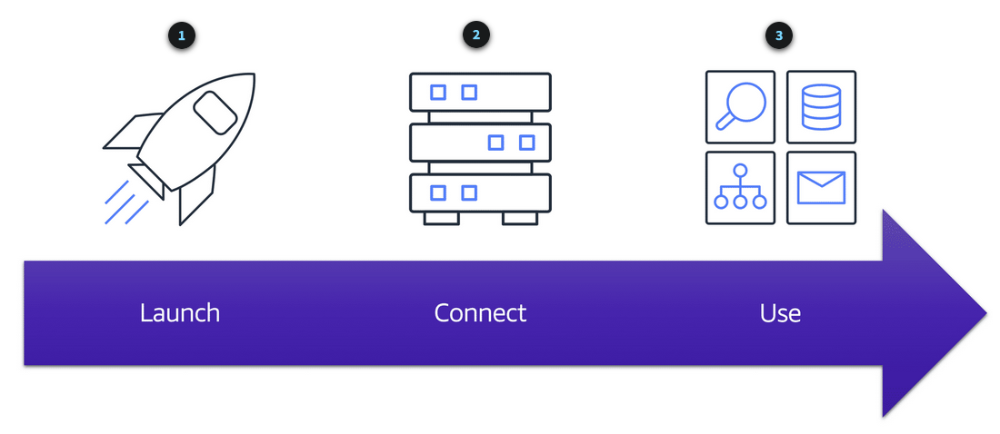

**Table of Contents**
- [Elastic Compute Cloud (EC2)](#elastic-compute-cloud-ec2)
	- [How Does EC2 Work](#how-does-ec2-work)
	- [EC2 Instance Types](#ec2-instance-types)
		- [General Purpose Instances](#general-purpose-instances)
		- [Compute Optimized Instances](#compute-optimized-instances)
		- [Memory Optimized Instances](#memory-optimized-instances)
		- [Accelerated Computing Instances](#accelerated-computing-instances)
		- [Storage Optimized Instances](#storage-optimized-instances)
	- [EC2 Pricing](#ec2-pricing)
		- [On-Demand](#on-demand)
		- [Savings Plans](#savings-plans)
		- [Reserved Instances](#reserved-instances)
		- [Spot Instances](#spot-instances)
		- [Dedicated Hosts](#dedicated-hosts)
	- [Scaling EC2 Instances](#scaling-ec2-instances)
		- [Scalability](#scalability)
		- [Amazon EC2 Auto Scaling](#amazon-ec2-auto-scaling)
		- [Auto Scaling Setup](#auto-scaling-setup)

 

---
---

 

# Elastic Compute Cloud (EC2)
- [Amazon Elastic Compute Cloud (Amazon EC2)](https://aws.amazon.com/ec2/) provides secure, resizable compute capacity in the cloud as Amazon EC2 instances.
- With traditional on-premises resources, you have to do the following:
	- Spend money upfront to purchase hardware.
	- Wait for the servers to be delivered to you.
	- Install the servers in your physical data center.
	- Make all the necessary configurations.
- By comparison, with an Amazon EC2 instance you can use a virtual server to run applications in the AWS Cloud
	- provision and launch an Amazon EC2 instance within minutes
	- stop using it when you have finished running a workload
	- pay only for the compute time you use when an instance is running, not when it is stopped or terminated
	- save costs by paying only for server capacity that you need or want
- EC2 instances share resources on a server, as they are implemented on a server as Virtual Machines
	- --> *multitenancy*

---

## How Does EC2 Work
1. Launch an instance
	- select template with basic *configurations* for your instance
	- configurations include the operating system, application server, or applications
	- also select the *instance type*, which is the specific hardware configuration of your instance
2. Connect to instance
	- Programs and applications have multiple different methods to connect directly to the instance and exchange data
	- Users can also connect to the instance by logging in and accessing the computer desktop
3. Use the instance
	- Begin using it
	- run commands to install software, add storage, copy and organize files, and more

 

 

---

## EC2 Instance Types

### General Purpose Instances
- provide a balance of compute, memory, and networking resources. You can use them for a variety of workloads, such as:
	- application servers
	- gaming servers
	- backend servers for enterprise applications
	- small and medium databases

> **Note**
>
> Suppose that you have an application in which the resource needs for compute, memory, and networking are roughly equivalent. You might consider running it on a general purpose instance because the application does not require optimization in any single resource area.

### Compute Optimized Instances
- ideal for compute-bound applications that benefit from *high-performance processors*
- like general purpose instances, you can use compute optimized instances for workloads such as web, application, and gaming servers
- difference is compute optimized applications are ideal for high-performance web servers, compute-intensive applications servers, and dedicated gaming servers
- also use compute optimized instances for batch processing workloads that require processing many transactions in a single group.

### Memory Optimized Instances
- designed to deliver fast performance for workloads that *process large datasets in memory*
- In computing, memory is a temporary storage area
	- holds all the data and instructions that a central processing unit (CPU) needs to be able to complete actions
	- before a computer program or application is able to run, it is loaded from storage into memory
	- this preloading process gives the CPU direct access to the computer program.

> **Note**
>
> Suppose that you have a workload that requires large amounts of data to be preloaded before running an application. This scenario might be a high-performance database or a workload that involves performing real-time processing of a large amount of unstructured data.
> In these types of use cases, consider using a memory optimized instance. Memory optimized instances enable you to run workloads with high memory needs and receive great performance.

### Accelerated Computing Instances
- use *hardware accelerators*, or coprocessors, to perform some functions more efficiently than is possible in software running on CPUs
	- hardware accelerator is a component that can expedite data processing
- examples of these functions include floating-point number calculations, graphics processing, and data pattern matching
- accelerated computing instances are ideal for workloads such as graphics applications, game streaming, and application streaming

### Storage Optimized Instances
- designed for workloads that require high, sequential read and write access to large datasets on local storage
- examples of workloads suitable for storage optimized instances include distributed file systems, data warehousing applications, and high-frequency online transaction processing (OLTP) systems
- In computing, the term *input/output operations per second (IOPS)* is a metric that measures the performance of a storage device
	- indicates, how many different input or output operations a device can perform in one second
	- *input operations*: data put into a system, such as records entered into a database
	- *output operation*: data generated by a server
		- An example of output might be the analytics performed on the records in a database
- an application has a high IOPS requirement: storage optimized instance can provide better performance over other instance types not optimized for this kind of use case:
	- Storage optimized instances are designed to deliver tens of thousands of low-latency, random IOPS to applications

---

## EC2 Pricing
- pay only for the compute time that you use
- Amazon EC2 offers a variety of pricing options for different use cases:

### On-Demand
- ideal for short-term, irregular workloads that cannot be interrupted
- no upfront costs or minimum contracts apply
- instances run continuously until you stop them, and you pay for only the compute time you use
- Sample use cases:
	- developing and testing applications and running applications that have unpredictable usage patterns
	- not recommended for workloads that last a year or longer because these workloads can experience greater cost savings using Reserved Instances

### Savings Plans
- Savings Plans for several compute services, including Amazon EC2
- Amazon EC2 Savings Plans enable to reduce compute costs by committing to a consistent amount of compute usage for a 1-year or 3-year term
- term commitment results in savings of up to 72% over On-Demand costs
- any usage up to the commitment is charged at the discounted Savings Plan rate (for example, $10 an hour)
- any usage beyond the commitment is charged at regular On-Demand rates.

### Reserved Instances
- billing discount applied to the use of On-Demand Instances in your account
- purchase Standard Reserved and Convertible Reserved Instances for a 1-year or 3-year term, and Scheduled Reserved Instances for a 1-year term
	- greater cost savings with the 3-year option
- At the end of a Reserved Instance term, you can continue using the Amazon EC2 instance without interruption
- however, you are charged On-Demand rates until you do one of the following:
	- Terminate the instance.
	- Purchase a new Reserved Instance that matches the instance attributes (instance type, Region, tenancy, and platform)

### Spot Instances
- ideal for workloads with flexible start and end times, or that can withstand interruptions
- Spot Instances use unused Amazon EC2 computing capacity and offer you cost savings at up to 90% off of On-Demand prices

> **Example**
>
> Suppose that you have a background processing job that can start and stop as needed (such as the data processing job for a customer survey). You want to start and stop the processing job without affecting the overall operations of your business. If you make a Spot request and Amazon EC2 capacity is available, your Spot Instance launches. However, if you make a Spot request and Amazon EC2 capacity is unavailable, the request is not successful until capacity becomes available. The unavailable capacity might delay the launch of your background processing job.
> After you have launched a Spot Instance, if capacity is no longer available or demand for Spot Instances increases, your instance may be interrupted. This might not pose any issues for your background processing job. However, in the earlier example of developing and testing applications, you would most likely want to avoid unexpected interruptions. Therefore, choose a different EC2 instance type that is ideal for those tasks.

### Dedicated Hosts
- physical servers with Amazon EC2 instance capacity that is fully dedicated to your use
- use your existing per-socket, per-core, or per-VM software licenses to help maintain license compliance
- purchase On-Demand Dedicated Hosts and Dedicated Hosts Reservations.
- Of all the Amazon EC2 options that were covered, Dedicated Hosts are the most expensive.

---

## Scaling EC2

### Scalability
- involves beginning with only the resources needed and designing architecture to automatically respond to changing demand by scaling out or in
- pay for only the resources used
- don’t worry about a lack of computing capacity to meet customers’ needs.
- scaling process to happen automatically: **Amazon EC2 Auto Scaling**

### Amazon EC2 Auto Scaling
- enables to automatically add or remove Amazon EC2 instances in response to changing application demand
- By automatically scaling instances in and out as needed maintains a greater sense of application availability
- two approaches within Amazon EC2 Auto Scaling: dynamic scaling and predictive scaling.
	- *Dynamic scaling* responds to changing demand 
	- *Predictive scaling* automatically schedules the right number of Amazon EC2 instances based on predicted demand

 

 

### Auto Scaling Setup

1. When creating an Auto Scaling group, set the minimum number of Amazon EC2 instances.
	- **minimum capacity** is the number of Amazon EC2 instances that launch immediately after Auto Scaling group is created
2. Next, set the **desired capacity** at e.g. two Amazon EC2 instances even though application needs a minimum of a single Amazon EC2 instance to run.

 

 

> **Info**
>
> If you do not specify the desired number of Amazon EC2 instances in an Auto Scaling group, the desired capacity defaults to your minimum capacity.

3. **maximum capacity**: for example, configure the Auto Scaling group to scale out in response to increased demand, but only to a maximum of four Amazon EC2 instances

- Because Amazon EC2 Auto Scaling uses Amazon EC2 instances, only the instances used need to be payed
- a cost-effective architecture that provides the best customer experience while reducing expenses
