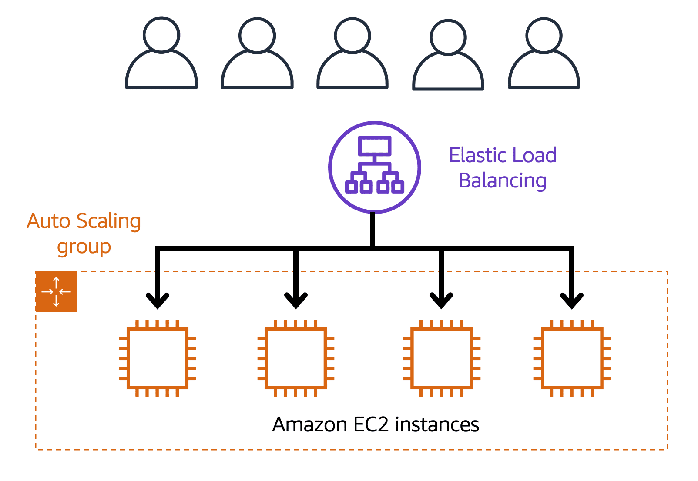

**Table of Contents**
- [Elastic Load Balancing](#elastic-load-balancing)
	- [Load Balancing](#load-balancing)
	- [Elastic Load Balancing Example](#elastic-load-balancing-example)

 

---
---

 

# Elastic Load Balancing

## Load Balancing

- AWS service that automatically distributes incoming application traffic across multiple resources, such as Amazon EC2 instances
- **load balancer** acts as a single point of contact for all incoming web traffic to e.g. a Auto Scaling group
	- as Amazon EC2 instances are added or removed in response to the amount of incoming traffic, requests route to the load balancer first
	- Then, the requests spread across multiple resources that will handle them
- Although Elastic Load Balancing and Amazon EC2 Auto Scaling are separate services, they work together to help ensure that applications running in Amazon EC2 can provide high performance and availability

## Elastic Load Balancing Example

> **Example - Low-demand period**
>
> An example of how Elastic Load Balancing works. Suppose that a few customers have come to the coffee shop and are ready to place their orders. 
> If only a few registers are open, this matches the demand of customers who need service. The coffee shop is less likely to have open registers with no customers. In this example, you can think of the registers as Amazon EC2 instances.

 

 
 
 

> **Example - High-demand period**
>
> Throughout the day, as the number of customers increases, the coffee shop opens more registers to accommodate them. In the diagram, the Auto Scaling group represents this.
> Additionally, a coffee shop employee directs customers to the most appropriate register so that the number of requests can evenly distribute across the open registers. You can think of this coffee shop employee as a load balancer.

 

 
