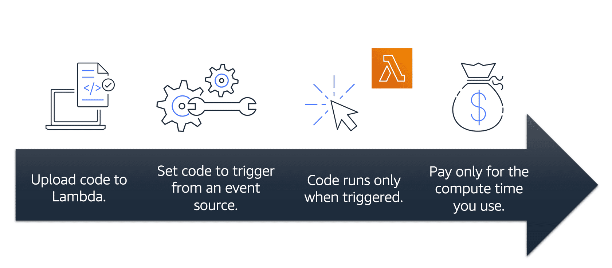

**Table of Contents**
- [Serverless Computing](#serverless-computing)
    - [AWS Lambda](#aws-lambda)
- [Containerized Applications](#containerized-applications)
    - [Container](#container)
    - [Amazon Elastic Container Service (Amazon ECS)](#amazon-elastic-container-service-amazon-ecs)
    - [Amazon Elastic Kubernetes Service (Amazon EKS)](#amazon-elastic-kubernetes-service-amazon-eks)
    - [AWS Fargate](#aws-fargate)

 

---
---

 

# Serverless Computing

If you have applications that you want to run in Amazon EC2, you must do the following:

1. Provision instances (virtual servers)
2. Upload your code
3. Continue to manage the instances while your application is running

- term **“serverless”** means that code runs on servers, but without needing to provision or manage these servers
- With serverless computing, focus can be more on innovating new products and features instead of maintaining servers
- Another benefit of serverless computing is the flexibility to scale serverless applications automatically
- Serverless computing can adjust the applications' capacity by modifying the units of consumptions, such as throughput and memory. 

An AWS service for serverless computing is **AWS Lambda**.

 

 

## AWS Lambda

- [AWS Lambda](https://aws.amazon.com/lambda): service to run code without needing to provision or manage servers
- pay only for the compute time that is consumed --> charges apply only when code is running
- run code for virtually any type of application or backend service, all with zero administration 

> **Example**
>
> For example, a simple Lambda function might involve automatically resizing uploaded images to the AWS Cloud. In this case, the function triggers when uploading a new image.

 

 

1. You upload code to Lambda.
2. Set code to trigger from an event source, such as AWS services, mobile applications, or HTTP endpoints
3. Lambda runs code only when triggered
4. Pay only for the compute time that is used.

---
---

# Containerized Applications

## Container

- provide a standard way to package application code and dependencies into a single object
- can also use containers for processes and workflows in which there are essential requirements for security, reliability, and scalability

## Amazon Elastic Container Service (Amazon ECS)

- highly scalable, high-performance container management system that enables to run and scale containerized applications on AWS
- Amazon ECS supports Docker containers
- AWS supports the use of open-source Docker Community Edition and subscription-based Docker Enterprise Edition
- With Amazon ECS, use API calls to launch and stop Docker-enabled applications

## Amazon Elastic Kubernetes Service (Amazon EKS)

- a fully managed service that you can use to run Kubernetes on AWS. 
- As new features and functionalities release for Kubernetes applications, these can easily be applied to applications managed by Amazon EKS.

## AWS Fargate

- serverless compute engine for containers
- works with both Amazon ECS and Amazon EKS. 
- When using AWS Fargate, provision or manage servers is not needed
- AWS Fargate manages server infrastructure
- --> focus more on innovating and developing applications, and pay only for the resources that are required to run containers