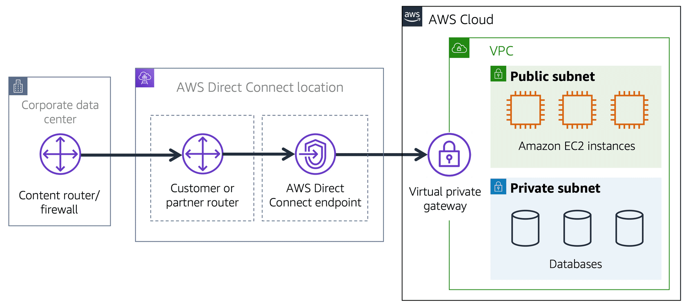

**Table of Contents**
- [Amazon Virtual Private Cloud (Amazon VPC)](#amazon-virtual-private-cloud-amazon-vpc)
- [Internet Gateway](#internet-gateway)
- [Virtual Private Gateway](#virtual-private-gateway)
- [AWS Direct Connect](#aws-direct-connect)

 

---
---

 

# Amazon Virtual Private Cloud (Amazon VPC)

- used to establish boundaries around your AWS resources: [**Amazon Virtual Private Cloud (Amazon VPC)**](https://aws.amazon.com/vpc/).
- enables to provision an isolated section of the AWS Cloud
	- launch resources in a virtual network defined
	- within **virtual private cloud (VPC)**, resources can be organized into subnets
	- **subnet** is a section of a VPC that can contain resources such as Amazon EC2 instances

# Internet Gateway

- to allow public traffic from internet to access VPC, attach an **internet gateway** to the VPC
- internet gateway is a connection between a VPC and the internet
- without an internet gateway, no one can access the resources within VPC

 

 

# Virtual Private Gateway

- To access private resources in a VPC, you can use a **virtual private gateway**. 
- virtual private gateway is the component that allows protected internet traffic to enter into the VPC
- enables to establish a **virtual private network (VPN)** connection between VPC and a private network, such as an on-premises data center or internal corporate network
- virtual private gateway allows traffic into the VPC only if it is coming from an approved network

 

 

> **Example**
>
> Here’s an example of how a virtual private gateway works. You can think of the internet as the road between your home and the coffee shop. Suppose that you are traveling on this road with a bodyguard to protect you. You are still using the same road as other customers, but with an extra layer of protection.
> The bodyguard is like a virtual private network (VPN) connection that encrypts (or protects) your internet traffic from all the other requests around it. 

# AWS Direct Connect

- [**AWS Direct Connect**](https://aws.amazon.com/directconnect/) is a service that enables to establish a dedicated private connection between data center and a VPC
- private connection that AWS Direct Connect provides helps to reduce network costs and increase the amount of bandwidth that can travel through the network

 

 