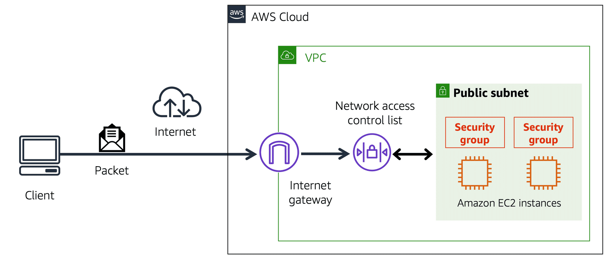

**Table of Contents**
- [Subnets](#subnets)
- [Network Traffic in a VPC](#network-traffic-in-a-vpc)
	- [Network Packet](#network-packet)
	- [Network Access Control List](#network-access-control-list)
	- [Stateless Packet Filtering](#stateless-packet-filtering)
	- [Security Groups](#security-groups)
	- [Stateful Packet Filtering](#stateful-packet-filtering)

 

---
---

 

# Subnets

- subnet is a section of a VPC to group resources based on security or operational needs
- subnets can be *public* or *private*
- **Public subnets** contain resources that need to be accessible by the public
- **Private subnets** contain resources that should be accessible only through private network, such as a database that contains customers’ personal information
- In a VPC, subnets can communicate with each other

 

 

> **Example**
>
> For example, you might have an application that involves Amazon EC2 instances in a public subnet communicating with databases that are located in a private subnet.

---

# Network Traffic in a VPC

## Network Packet

- **packet** is a unit of data sent over the internet or a network. 
	- when customer requests data from an application hosted in the AWS Cloud, this request is sent as a packet
	- it enters into a VPC through an internet gateway
	- before a packet can enter into a subnet or exit from a subnet, it checks for permissions
	- these permissions indicate who sent the packet and how the packet is trying to communicate with the resources in a subnet

## Network Access Control List

- VPC component that checks packet permissions for subnets is a [**network access control list (ACL)**](https://docs.aws.amazon.com/vpc/latest/userguide/vpc-network-acls.html).
	- virtual firewall that controls inbound and outbound traffic at the subnet level
	- AWS accounts include default network ACL
	- when configuring VPC, use account’s default network ACL or create custom network ACLs
	- by default, account’s default network ACL allows all inbound and outbound traffic
		- can be modified by adding rules
	- for custom network ACLs, all inbound and outbound traffic is denied until rules are added to specify which traffic to allow.
	- additionally, all network ACLs have an explicit deny rule: ensures that if a packet doesn’t match any of the other rules on the list, the packet is denied

 

 

## Stateless Packet Filtering

- Network ACLs perform **stateless** packet filtering: remember nothing and check packets that cross the subnet border each way: inbound and outbound
- when a packet response for a that request comes back to the subnet, the network ACL does not remember previous requests (e.g., response of a outgoing request)
	- network ACL checks the packet response against its list of rules to determine whether to allow or deny.
- after a packet has entered a subnet, it must have its permissions evaluated for resources within the subnet, such as Amazon EC2 instances
- VPC component that checks packet permissions for an Amazon EC2 instance is a [**security group**](https://docs.aws.amazon.com/vpc/latest/userguide/VPC_SecurityGroups.html).

## Security Groups

- security group is a virtual firewall that controls inbound and outbound traffic for an Amazon EC2 instance -> instance level security
- by default, a security group denies all inbound traffic and allows all outbound traffic
	- add custom rules to configure which traffic to allow or deny
- with multiple Amazon EC2 instances within a subnet, associate them with the same security group or use different security groups for each instance

## Stateful Packet Filtering

- Security groups perform **stateful** packet filtering: remember previous decisions made for incoming packets
- when a packet response for a request returns to the instance, the security group remembers previous request
	- security group allows the response to proceed, regardless of inbound security group rules
- both network ACLs and security groups enable to configure custom rules for the traffic in VPC

 

 