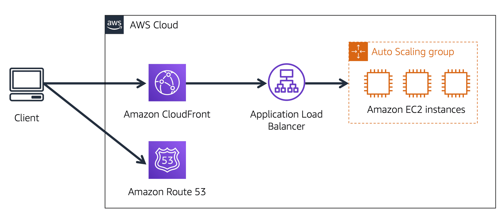

**Table of Contents**
- [Domain Name System (DNS)](#domain-name-system-dns)
- [Amazon Route 53](#amazon-route-53)

 

---
---

 

# Domain Name System (DNS)

- **Domain Name System (DNS)** resolution: DNS resolution involves a customer DNS resolver communicating with a company DNS server
- think of DNS as being the phone book of the internet, DNS resolution is the process of translating a domain name to an IP address

 

 

# Amazon Route 53

- [**Amazon Route 53**](https://aws.amazon.com/route53) is a DNS web service
- gives developers and businesses a reliable way to route end users to internet applications hosted in AWS
- Amazon Route 53 connects user requests to infrastructure running in AWS (such as Amazon EC2 instances and load balancers)
- it can route users to infrastructure outside of AWS
- another feature of Route 53 is the ability to manage the DNS records for domain names
	- register new domain names directly in Route 53
	- transfer DNS records for existing domain names managed by other domain registrars

#### Example: Amazon Route 53 and Amazon CloudFront Deliver Content

 

 

Suppose that AnyCompany’s application is running on several Amazon EC2 instances. These instances are in an Auto Scaling group that attaches to an Application Load Balancer.

1. customer requests data from application by going to AnyCompany’s website
2. Amazon Route 53 uses DNS resolution to identify AnyCompany.com’s corresponding IP address, 192.0.2.0 - information is sent back to customer
3. customer’s request is sent to nearest edge location through Amazon CloudFront
4. Amazon CloudFront connects to Application Load Balancer, which sends the incoming packet to an Amazon EC2 instance