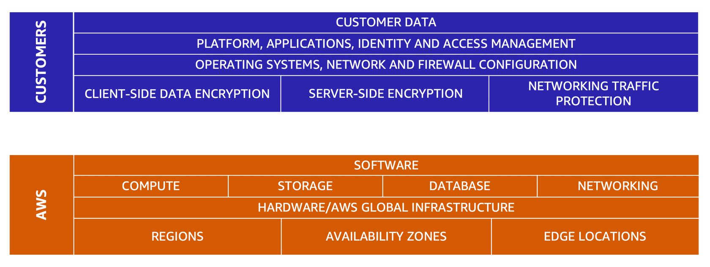

**Table of Contents**
- [Shared Responsibility Model](#shared-responsibility-model)
	- [Customers: Security in the Cloud](#customers-security-in-the-cloud)
	- [AWS: Security of the Cloud](#aws-security-of-the-cloud)

 

---
---

 

# Shared Responsibility Model

- AWS is responsible for some parts of environment and the customer are responsible for some other parts: *shared responsible model*
- dives into customer responsibilities (referred to as *"security in the cloud"*) and AWS responsibilities (referred to as *"security of the cloud"*)

 

 

## Customers: Security in the Cloud

- responsible for the security of everything that they create and put in the AWS Cloud
- maintain complete control over the content -> responsibility for managing security requirements for the content
	- this includes which content to store on AWS, which AWS services to use, who has access to that content, as well as how access rights are granted, managed, and revoked
- security steps depend on factors such as the services chosen, complexity of systems, and company's specific operational and security needs

## AWS: Security of the Cloud

- responsible to operate, manage, and control the components at all layers of infrastructure
	- including areas such as host operating system, virtualization layer, and even the physical security of the data centers from which service operate
- protecting global infrastructure that runs all of the services offered: AWS Regions, Availability Zones, and edge locations
	- Physical security of data centers
	- Hardware and software infrastructure
	- Network infrastructure
	- Virtualization infrastructure