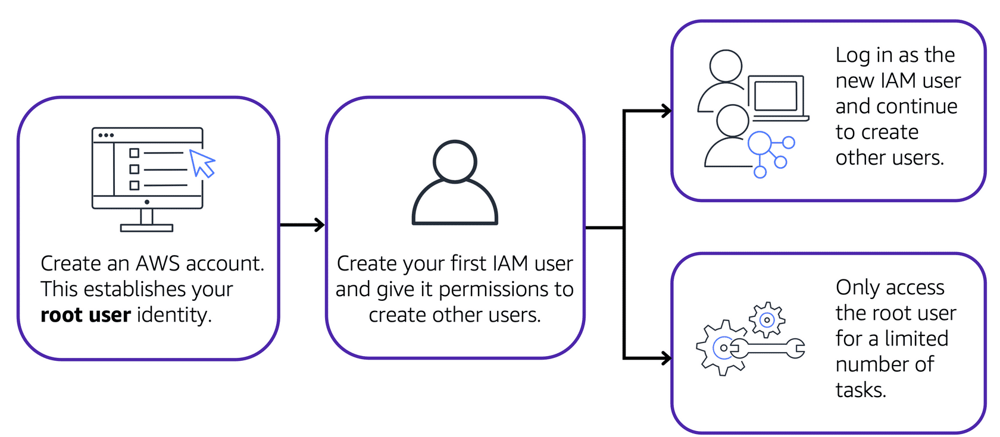

**Table of Contents**
- [AWS Identity and Access Management (IAM)](#aws-identity-and-access-management-iam)
- [IAM Object Types](#iam-object-types)
	- [AWS account Root User](#aws-account-root-user)
	- [IAM Users](#iam-users)
	- [IAM Policies](#iam-policies)
	- [IAM Groups](#iam-groups)
	- [IAM Roles](#iam-roles)
- [Multi-factor Authentication (MFA)](#multi-factor-authentication)

 

---
---

 

# AWS Identity and Access Management (IAM)

- [AWS Identity and Access Management (IAM)](https://aws.amazon.com/iam/) enables to manage access to AWS services and resources securely
- gives flexibility to configure access based on your company's specific operational and security needs
- implemented using a combination of IAM features:
	- IAM users, groups, and roles
	- IAM policies
	- Multi-factor authentication

---

# IAM Object Types

## AWS account Root User

- [root user](https://docs.aws.amazon.com/IAM/latest/UserGuide/id_root-user.html) is accessed by signing in with email address and password used to create AWS account
- has complete access to all the AWS services and resources in the account

 

 

> **Best Practice**
>
> Do **not** use the root user for everyday tasks.
> 
> Instead, use the root user to create your first IAM user and assign it permissions to create other users.
> 
> Then, continue to create other IAM users, and access those identities for performing regular tasks throughout AWS. Only use the root user when you need to perform a limited number of tasks that are only available to the root user. Examples of these tasks include changing your root user email address and changing your AWS support plan.

## IAM Users

- an identity create in AWS
- represents the person or application that interacts with AWS services and resources
- consists of a name and credentials
- by default, has no permissions associated with it
- must be granted necessary permissions to perform specific actions in AWS

> **Best Practice**
>
> We recommend that you create individual IAM users for each person who needs to access AWS.
> 
> Even if you have multiple employees who require the same level of access, you should create individual IAM users for each of them. This provides additional security by allowing each IAM user to have a unique set of security credentials.

## IAM Policies

- document that allows or denies permissions to AWS services and resources
- enables to customize users' levels of access to resources

> **Best Practice**
>
> Follow the security principle of **least privilege** when granting permissions.
> 
> By following this principle, you help to prevent users or roles from having more permissions than needed to perform their tasks.
> 
> For example, if an employee needs access to only a specific bucket, specify the bucket in the IAM policy. Do this instead of granting the employee access to all of the buckets in your AWS account.

Example IAM policy!

 

 

## IAM Groups

- [IAM group](https://docs.aws.amazon.com/IAM/latest/UserGuide/id_groups.html) is a collection of IAM users
- assigning an IAM policy to a group, all users in the group are granted permissions specified by the policy

## IAM Roles

- [IAM role](https://docs.aws.amazon.com/IAM/latest/UserGuide/id_roles.html) is a identity that a object can assume to gain temporary access to permissions
- before an IAM user, application, or service can assume an IAM role, they must be granted permissions to switch to the role
- when someone assumes an IAM role, they abandon all previous permissions that they had under a previous role and assume the permissions of the new role

> **Best Practice**
>
> IAM roles are ideal for situations in which access to services or resources needs to be granted temporarily, instead of long-term.

---

# Multi-factor Authentication

- [multi-factor authentication](https://aws.amazon.com/iam/features/mfa/) provides an extra layer of security for an AWS account by requiring to provide multiple pieces of information for verification