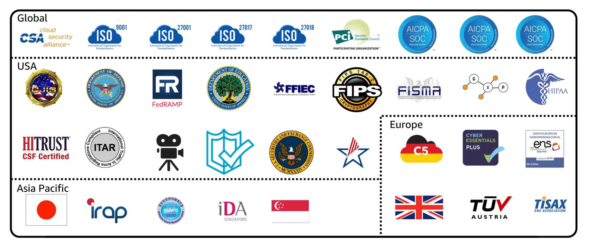

**Table of Contents**
- [AWS Artifact](#aws-artifact)
	- [AWS Artifact Agreements](#aws-artifact-agreements)
	- [AWS Artifact Reports](#aws-artifact-reports)
- [Customer Compliance Center](#customer-compliance-center)

 

---
---

 

# AWS Artifact

- [AWS Artifact](https://aws.amazon.com/artifact): service that provides on-demand access to AWS security and compliance reports and select online agreements
- consists of two main sections:
	- AWS Artifact Agreements
	- AWS Artifact Reports

## AWS Artifact Agreements

- review, accept, and manage agreements for an individual account and for all your accounts in AWS Organizations
- Different types of agreements are offered to address the needs of customers who are subject to specific regulations, such as the Health Insurance Portability and Accountability Act (HIPAA)

## AWS Artifact Reports

- provides compliance reports from third-party auditors
	- auditors have tested and verified that AWS is compliant with a variety of global, regional, and industry-specific security standards and regulations
	- AWS Artifact Reports remains up to date with the latest reports released
	- provide the AWS audit artifacts to auditors or regulators as evidence of AWS security controls

 

 

---

# Customer Compliance Center

- [Customer Compliance Center](https://aws.amazon.com/compliance/customer-center/) contains resources to help learn more about AWS compliance
- read customer compliance stories to discover how companies in regulated industries have solved various compliance, governance, and audit challenges
- access compliance whitepapers and documentation on topics such as:
	- AWS answers to key compliance questions
	- An overview of AWS risk and compliance
	- An auditing security checklist
- includes an auditor learning path
	- designed for individuals in auditing, compliance, and legal roles who want to learn more about how their internal operations can demonstrate compliance using the AWS Cloud