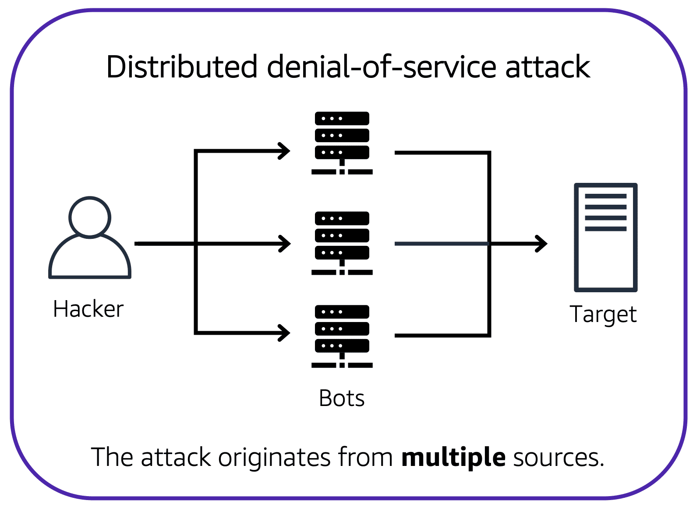

**Table of Contents**
- [Denial-of-service Attacks](#denial-of-service-attacks)
- [Distributed Denial-of-service Attacks](#distributed-denial-of-service-attacks)
- [AWS Shield](#aws-shield)
	- [AWS Shield Standard](#aws-shield-standard)
	- [AWS Shield Advanced](#aws-shield-advanced)

 

---
---

 

# Denial-of-service Attacks

- denial-of-service (DoS) attack is a deliberate attempt to make a website or application unavailable to users

---

# Distributed Denial-of-service Attacks

- multiple sources are used to start an attack that aims to make a website or application unavailable
- can come from a group of attackers, or even a single attacker
	- single attacker can use multiple infected computers (also known as “bots”) to send excessive traffic to a website or application
- to help minimize the effect of DoS and DDoS attacks on your applications, you can use [AWS Shield](https://aws.amazon.com/shield)

 

 

---

# AWS Shield

- service that protects applications against DDoS attacks
- provides two levels of protection: Standard and Advanced

## AWS Shield Standard

- automatically protects all AWS customers at no cost
- protects your AWS resources from the most common, frequently occurring types of DDoS attacks
- As network traffic comes into an applications, AWS Shield Standard uses a variety of analysis techniques to detect malicious traffic in real time and automatically mitigates it

## AWS Shield Advanced

- paid service that provides detailed attack diagnostics and ability to detect and mitigate sophisticated DDoS attacks
- also integrates with other services such as Amazon CloudFront, Amazon Route 53, and Elastic Load Balancing
- Additionally, can be integrated with AWS WAF by writing custom rules to mitigate complex DDoS attacks