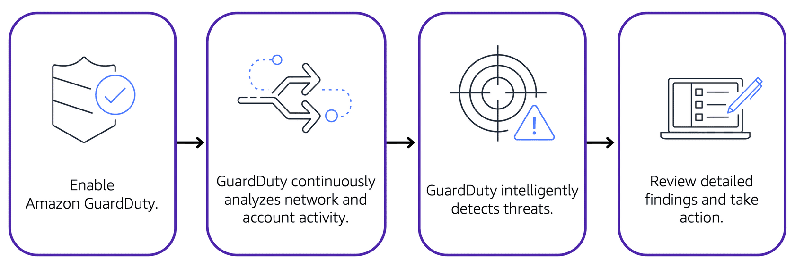

**Table of Contents**
- [AWS Key Management Service (AWS KMS)](#aws-key-management-service-aws-kms)
- [AWS WAF - Web Application Firewall](#aws-waf---web-application-firewall)
- [Amazon Inspector](#amazon-inspector)
- [Amazon GuardDuty](#amazon-guardduty)

 

---
---

 

# AWS Key Management Service (AWS KMS)

- [AWS Key Management Service (AWS KMS)](https://aws.amazon.com/kms) enables to perform encryption operations through the use of *cryptographic keys*
	- a random string of digits used for locking (encrypting) and unlocking (decrypting) data
- use AWS KMS to create, manage, and use cryptographic keys
- control use of keys across a wide range of services and in applications
- choose the specific levels of access control that is needed for keys
	- specify which IAM users and roles are able to manage keys
	- temporarily disable keys so that they are no longer in use by anyone
- keys never leave AWS KMS, and the customer is always in control of them

---

# AWS WAF - Web Application Firewall

- [AWS WAF](https://aws.amazon.com/waf) is a web application firewall that allows to monitor network requests that come into web applications
- works together with Amazon CloudFront and an Application Load Balancer
- works in a similar way to network access control lists (see [Subnets and ACLs]()) to block or allow traffic. However, it does this by using a [web access control list (ACL)](https://docs.aws.amazon.com/waf/latest/developerguide/web-acl.html)

---

# Amazon Inspector

- performs automated security assessments: [Amazon Inspector](https://aws.amazon.com/inspector/)
- checks applications for security vulnerabilities and deviations from security best practices, such as open access to Amazon EC2 instances and installations of vulnerable software versions 
- After Amazon Inspector has performed an assessment, it provides a list of security findings
	- prioritizes by severity level, including a detailed description of each security issue and a recommendation for how to fix it
- does not guarantee that following the provided recommendations resolves every potential security issue
- Under the shared responsibility model, customers are responsible for the security of their applications, processes, and tools that run on AWS services

---

# Amazon GuardDuty

- [Amazon GuardDuty](https://aws.amazon.com/guardduty): service that provides intelligent threat detection for AWS infrastructure and resources
- identifies threats by continuously monitoring the network activity and account behavior within an AWS environment

 

 

- when enabled, GuardDuty begins monitoring network and account activity
	- no deployment or management of any additional security software needed
	- continuously analyzes data from multiple AWS sources, including VPC Flow Logs and DNS logs
- If threats are detected, findings can be reviewed in detailed from the AWS Management Console
	- Findings include recommended steps for remediation
- configure AWS Lambda functions to take remediation steps automatically in response to GuardDuty’s security findings