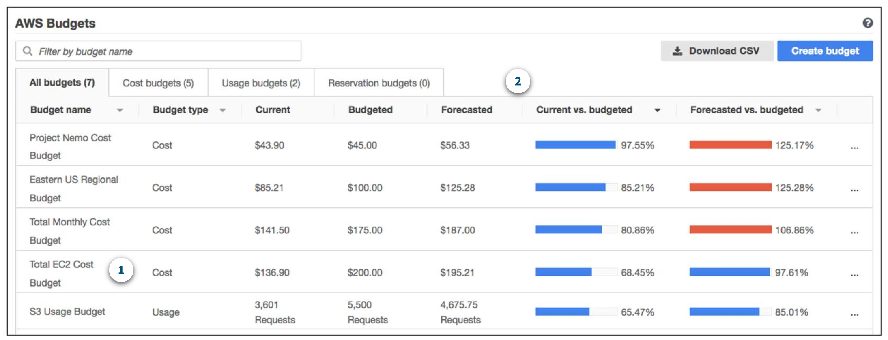
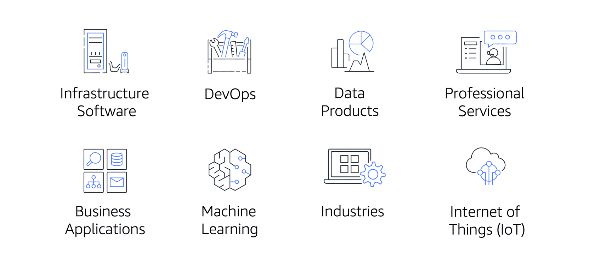

**Table of Contents**
- [AWS Free Tier](#aws-free-tier)
- [Pricing](#pricing)
	- [Concepts](#concepts)
	- [Calculation](#calculation)
- [Billing](#billing)
	- [Billing Dashboard](#billing-dashboard)
	- [Consolidated Billing](#consolidated-billing)
	- [AWS Budget](#aws-budget)
	- [AWS Cost Explorer](#aws-cost-explorer)
- [AWS Support](#aws-support)
	- [Basic Support](#basic-support)
	- [Developer Support](#developer-support)
	- [Business Support](#business-support)
	- [Enterprise On-Ramp Support](#enterprise-on-ramp-support)
	- [Enterprise Support](#enterprise-support)
- [AWS Marketplace](#aws-marketplace)

 

---
---

 

# AWS Free Tier

- enables to begin using certain services without having to worry about incurring costs for the specified period 
- Three types of offers are available: 
	- **Always Free**
		- do not expire and are available to all AWS customers
		- > For example, AWS Lambda allows 1 million free requests and up to 3.2 million seconds of compute time per month. Amazon DynamoDB allows 25 GB of free storage per month.
	- **12 Months Free**
		- offers are free for 12 months following initial sign-up date to AWS.
		- > Examples include specific amounts of Amazon S3 Standard Storage, thresholds for monthly hours of Amazon EC2 compute time, and amounts of Amazon CloudFront data transfer out.
	- **Trials**
		- Short-term free trial offers start from the date particular service is activated. The length of each trial might vary by number of days or the amount of usage in the service.
		- > For example, Amazon Inspector offers a 90-day free trial. Amazon Lightsail (a service that enables you to run virtual private servers) offers 750 free hours of usage over a 30-day period.

---

# Pricing

## Concepts

- **Pay for what you use**
	- For each service, pay exactly the amount of resources that are actually used, without requiring long-term contracts or complex licensing.
- **Pay less when you reserve**
	- Some services offer reservation options that provide a significant discount compared to On-Demand Instance pricing.
	- > For example, suppose that your company is using Amazon EC2 instances for a workload that needs to run continuously. You might choose to run this workload on Amazon EC2 Instance Savings Plans, because the plan allows you to save up to 72% over the equivalent On-Demand Instance capacity.
- **Pay less with volume-based discounts when you use more**
	- Some services offer tiered pricing, so the per-unit cost is incrementally lower with increased usage.
	- > For example, the more Amazon S3 storage space you use, the less you pay for it per GB.

## Calculation

- [**AWS Pricing Calculator**](https://calculator.aws/#/) allows to explore AWS services and create an estimate for the cost of a use cases on AWS
- organize your AWS estimates by groups
- group can reflect how a company is organized, such as providing estimates by cost center
- save estimates and generate a link to share with others

---

# Billing

## Billing Dashboard

- [**AWS Billing & Cost Management dashboard**](https://docs.aws.amazon.com/awsaccountbilling/latest/aboutv2/billing-what-is.html) to pay AWS bill, monitor usage, and analyze and control costs
- Compare current month-to-date balance with the previous month, and get a forecast of the next month based on current usage
- View month-to-date spend by service
- View Free Tier usage by service
- Access Cost Explorer and create budgets
- Purchase and manage Savings Plans
- Publish [AWS Cost and Usage Reports](https://docs.aws.amazon.com/cur/latest/userguide/what-is-cur.html)

## Consolidated Billing

- AWS Organizations also provides the option for [**consolidated billing**](https://docs.aws.amazon.com/awsaccountbilling/latest/aboutv2/consolidated-billing.html)
- enables to receive a single bill for all AWS accounts in an organization
- easily track the combined costs of all the linked accounts in an organization
- default maximum number of accounts allowed for an organization is *4*, but contact AWS Support to increase quota, if needed
- On monthly bill, review itemized charges incurred by each account
- This enables to have greater transparency into organization’s accounts while still maintaining the convenience of receiving a single monthly bill
- share bulk discount pricing, Savings Plans, and Reserved Instances across the accounts in an organization

## AWS Budget

- [**AWS Budgets**](https://aws.amazon.com/aws-cost-management/aws-budgets) to create budgets and to plan service usage, service costs, and instance reservations
- information in AWS Budgets updates three times a day
- set custom alerts when usage exceeds (or is forecasted to exceed) the budgeted amount

 

 

## AWS Cost Explorer

- [**AWS Cost Explorer**](https://aws.amazon.com/aws-cost-management/aws-cost-explorer/) enables to visualize, understand, and manage your AWS costs and usage over time
- includes default report of the costs and usage for top five cost-accruing AWS services
- apply custom filters and groups to analyze data

 

 

---

# AWS Support

- different [**Support plans**](https://aws.amazon.com/premiumsupport/plans/) to help troubleshoot issues, lower costs, and efficiently use AWS services
- choose from the following Support plans to meet company’s needs: 
	- Basic
	- Developer
	- Business
	- Enterprise On-Ramp
	- Enterprise
- Developer, Business, Enterprise On-Ramp, and Enterprise Support plans include all the benefits of Basic Support, in addition to ability to open an unrestricted number of technical support cases
	- have pay-by-the-month pricing and require no long-term contracts
- Enterprise On-Ramp and Enterprise Support plans include access to a **Technical Account Manager (TAM)** 
	- primary point of contact at AWS
	- provides expert engineering guidance
	- helps design solutions that efficiently integrate AWS services
	- assist with cost-effective and resilient architectures
	- provide direct access to AWS programs and a broad community of experts.  
	- > For example, suppose that you are interested in developing an application that uses several AWS services together. Your TAM could provide insights into how to best use the services together. They achieve this, while aligning with the specific needs that your company is hoping to address through the new application.

## Basic Support

- free for all AWS customers
- includes access to whitepapers, documentation, and support communities
- contact AWS for billing questions and service limit increases
- access to a limited selection of AWS Trusted Advisor checks
- use the **AWS Personal Health Dashboard**: tool that provides alerts and remediation guidance when AWS is experiencing events

## Developer Support

additional features, including:

- Best practice guidance
- Client-side diagnostic tools
- Building-block architecture support, which consists of guidance for how to use AWS offerings, features, and services together

> **Example**
>
> For example, suppose that your company is exploring AWS services. You’ve heard about a few different AWS services. However, you’re unsure of how to potentially use them together to build applications that can address your company’s needs. In this scenario, the building-block architecture support that is included with the Developer Support plan could help you to identify opportunities for combining specific services and features.

## Business Support

- Use-case guidance to identify AWS offerings, features, and services that can best support your specific needs
- All AWS Trusted Advisor checks
- Limited support for third-party software, such as common operating systems and application stack components

> **Example**
>
> Suppose that your company has the Business Support plan and wants to install a common third-party operating system onto your Amazon EC2 instances. You could contact AWS Support for assistance with installing, configuring, and troubleshooting the operating system. For advanced topics such as optimizing performance, using custom scripts, or resolving security issues, you may need to contact the third-party software provider directly.

## Enterprise On-Ramp Support

in addition to all the features included in the Basic, Developer, and Business Support plans:

- pool of Technical Account Managers to provide proactive guidance and coordinate access to programs and AWS experts
- Cost Optimization workshop (one per year)
- Concierge support team for billing and account assistance
- Tools to monitor costs and performance through Trusted Advisor and Health API/Dashboard
- proactive support services, which are provided by a pool of Technical Account Managers:
	- Consultative review and architecture guidance (one per year)
	- Infrastructure Event Management support (one per year)
	- Support automation workflows
	- 30 minutes or less response time for business-critical issues

## Enterprise Support

in addition to all features included in the Basic, Developer, Business, and Enterprise On-Ramp support plans:

- A designated Technical Account Manager to provide proactive guidance and coordinate access to programs and AWS experts
- A Concierge support team for billing and account assistance
- Operations Reviews and tools to monitor health
- Training and Game Days to drive innovation
- Tools to monitor costs and performance through Trusted Advisor and Health API/Dashboard
- full access to proactive services, which are provided by a designated Technical Account Manager:
	- Consultative review and architecture guidance
	- Infrastructure Event Management support
	- Cost Optimization Workshop and tools
	- Support automation workflows
	- 15 minutes or less response time for business-critical issues

---

# AWS Marketplace

- digital catalog that includes thousands of software listings from independent software vendors
- each listing in AWS Marketplace, access detailed information on pricing options, available support, and reviews from other AWS customers

 

 