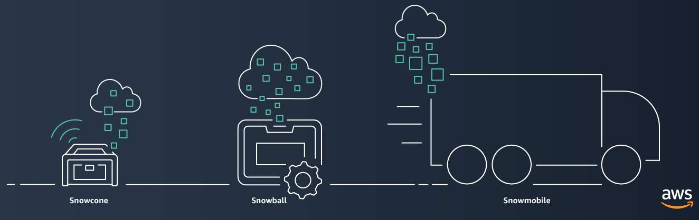

**Table of Contents**
- [AWS Cloud Migration Strategies](#aws-cloud-migration-strategies)
	- [Rehosting](#rehosting)
	- [Replatforming](#replatforming)
	- [Refactoring/re-architecting](#refactoringre-architecting)
	- [Repurchasing](#repurchasing)
	- [Retaining](#retaining)
	- [Retiring](#retiring)
- [AWS Snow Family](#aws-snow-family)
    - [AWS Snowcone](#aws-snowcone)
    - [AWS Snowball](#aws-snowball)
    - [AWS Snowmobile](#aws-snowmobile)

 

---
---

 

# AWS Cloud Migration Strategies

## Rehosting

- also known as “lift-and-shift”
- **involves moving applications without changes**
- In the scenario of a large legacy migration, in which the company is looking to implement its migration and scale quickly to meet a business case, the majority of applications are rehosted

## Replatforming

- also known as “lift, tinker, and shift"
- **involves making a few cloud optimizations to realize a tangible benefit**
- optimization is achieved without changing the core architecture of the application

## Refactoring/re-architecting

- **involves reimagining how an application is architected and developed by using cloud-native features**
- driven by a strong business need to add features, scale, or performance that would otherwise be difficult to achieve in the application’s existing environment

## Repurchasing

- **involves moving from a traditional license to a software-as-a-service model**
- For example, a business might choose to implement the repurchasing strategy by migrating from a customer relationship management (CRM) system to Salesforce.com.

## Retaining

- **consists of keeping applications that are critical for the business in the source environment**
- this might include applications that require major refactoring before they can be migrated, or, work that can be postponed until a later time

## Retiring

- **process of removing applications that are no longer needed**

---

# AWS Snow Family

- [**AWS Snow Family**](https://aws.amazon.com/snow) is a collection of physical devices that help to physically transport up to exabytes of data into and out of AWS
- devices offer different capacity points, and most include built-in computing capabilities
- AWS owns and manages the Snow Family devices and integrates with AWS security, monitoring, storage management, and computing capabilities

 

 

## AWS Snowcone

- [**AWS Snowcone**](https://aws.amazon.com/snowcone) is a small, rugged, and secure edge computing and data transfer device
- features 2 CPUs, 4 GB of memory, and 8 TB of usable storage.

## AWS Snowball

- [**AWS Snowball**](https://aws.amazon.com/snowball/) offers two types of devices:
    - **Snowball Edge Storage Optimized** devices are well suited for large-scale data migrations and recurring transfer workflows, in addition to local computing with higher capacity needs
        - Storage: 80 TB of hard disk drive (HDD) capacity for block volumes and Amazon S3 compatible object storage, and 1 TB of SATA solid state drive (SSD) for block volumes.
        - Compute: 40 vCPUs, and 80 GiB of memory to support Amazon EC2 sbe1 instances (equivalent to C5)
	- **Snowball Edge Compute Optimized** provides powerful computing resources for use cases such as machine learning, full motion video analysis, analytics, and local computing stacks
	    - Storage: 42-TB usable HDD capacity for Amazon S3 compatible object storage or Amazon EBS compatible block volumes and 7.68 TB of usable NVMe SSD capacity for Amazon EBS compatible block volumes.
	    - Compute: 52 vCPUs, 208 GiB of memory, and an optional NVIDIA Tesla V100 GPU. Devices run Amazon EC2 sbe-c and sbe-g instances, which are equivalent to C5, M5a, G3, and P3 instances

## AWS Snowmobile

- [**AWS Snowmobile**](https://aws.amazon.com/snowmobile) is an exabyte-scale data transfer service used to move large amounts of data to AWS
- You can transfer up to 100 petabytes of data per Snowmobile, a 45-foot long ruggedized shipping container, pulled by a semi trailer truck.